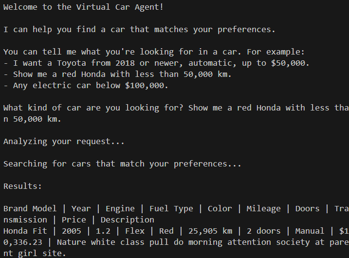

# Desafio Técnico C2S

Este repositório contém o código para o desafio técnico da C2S, que consiste em desenvolver uma aplicação de chat em Python utilizando a biblioteca `mcp` para a criação de um servidor e cliente. O sistema permite buscar carros em um banco de dados local, com filtros extraídos automaticamente de consultas em linguagem natural usando a API da OpenAI.

## Pré-requisitos

Antes de começar, certifique-se de ter instalado as seguintes ferramentas:

- [Python 3.13+](https://www.python.org/downloads/) *(versão mínima conforme `pyproject.toml`)*
- [Pip](https://pip.pypa.io/en/stable/installation/)
- [UV](https://astral.sh/uv/)

No Windows, você pode instalar o UV usando o seguinte comando no PowerShell:

```powershell
irm https://astral.sh/uv/install.ps1 | iex
```

No Linux ou macOS, você pode instalar o UV usando o seguinte comando no terminal:

```shell
curl -LsSf https://astral.sh/uv/install.sh | sh
```

## Configuração do Ambiente

1. **Clone o repositório e acesse a pasta do projeto.**
2. **Crie um ambiente virtual e instale as dependências:**

```shell
uv venv
uv sync
```

3. **Configure a variável de ambiente da OpenAI:**

O parser utiliza a API da OpenAI para extrair filtros das consultas. Crie um arquivo `.env` na raiz do projeto com o seguinte conteúdo:

```bat
OPENAI_API_KEY=seu_token_openai_aqui
```

## Executando o projeto

1. **Carregue os dados iniciais:**

```shell
python initial_data.py
```

2. **Inicie o cliente (que executa o servidor em segundo plano):**

```shell
python client.py
```

O cliente irá solicitar uma consulta em linguagem natural, encaminhar para o servidor, que processa, consulta o banco de dados e retorna os resultados formatados.

3. **(Opcional) Inicie apenas o servidor com interface gráfica do MCP:**

```shell
mcp dev server.py
```

## Testes

Para executar os testes, utilize o seguinte comando:

```shell
python -m pytest
```

## Estrutura dos principais arquivos

- `client.py`: Cliente de linha de comando que interage com o usuário e comunica-se com o servidor.
- `server.py`: Servidor MCP que processa as consultas e retorna os resultados.
- `initial_data.py`: Script para popular o banco de dados com dados fictícios.

- `app/models.py`: Modelos de dados e configuração do banco SQLite.
- `app/parser.py`: Parser que utiliza a OpenAI para extrair filtros das consultas.
- `app/services.py`: Serviços que implementam a lógica de negócios, incluindo a busca de carros.

## Demo



## Autor

- [Paulo R. Pereira Jr.](https://github.com/paulorobertouri)